# slidev-theme-technical

A **monospace, near-black, single-accent** [Slidev](https://sli.dev) theme for
technical talks — the kind of deck where you show code, commands, architecture
and systems.

The defining idea: **framed developer panels do the work that photos do in other
decks.** A sparse slide is filled with a terminal, a code window, or a diagram. A
technical audience reads that familiar developer chrome as meaningful, so a
minimal slide still feels substantial.

## Preview

Every layout and component, with the default purple accent (`#BD93F9`) and the
`❯` glyph.

### Layouts

#### Cover

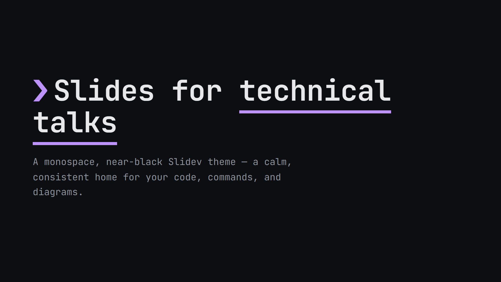

#### Section

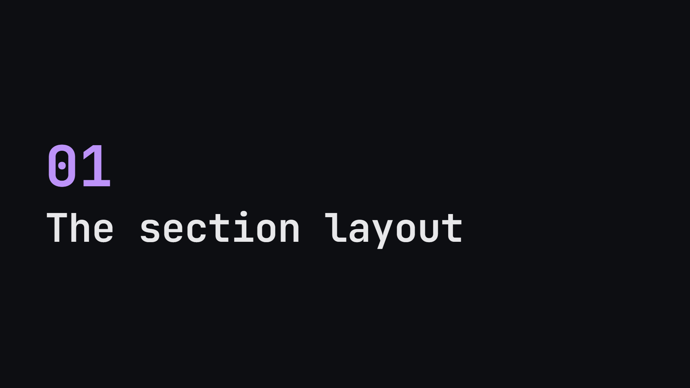

#### Default

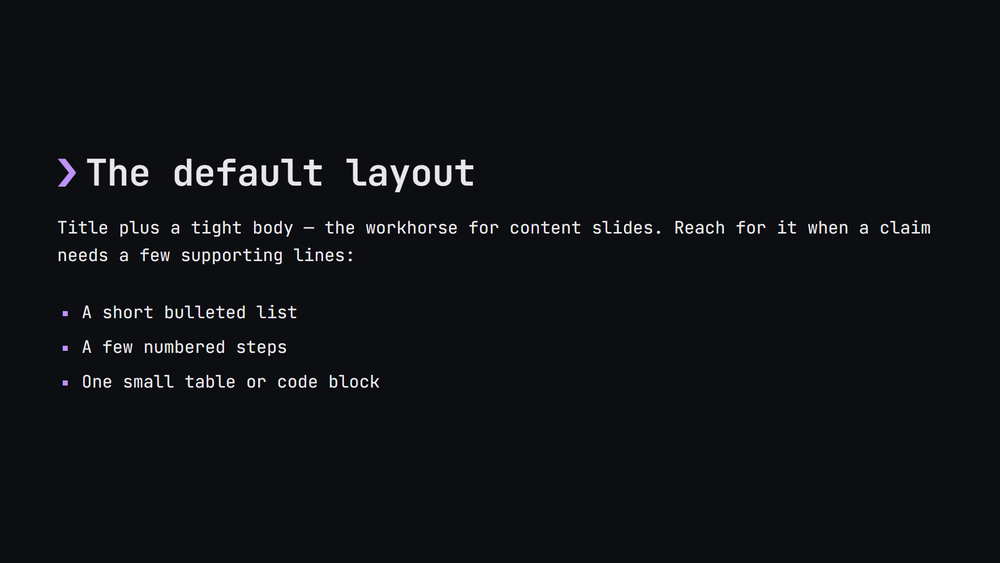

#### Two-cols

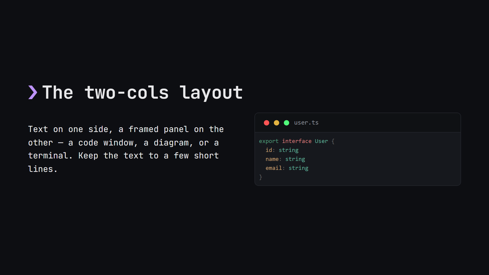

#### Full

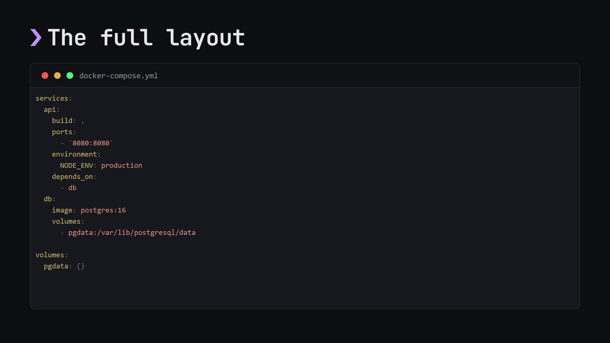

#### Center

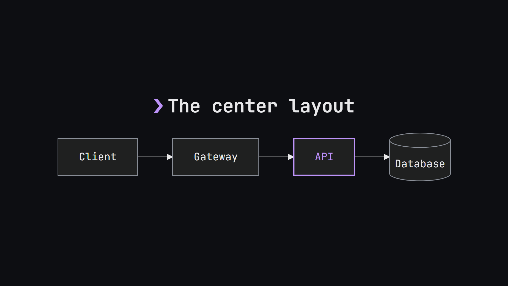

#### Statement

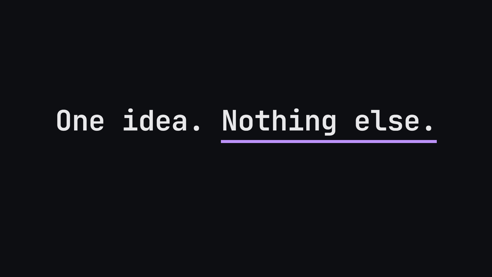

### Components

#### Code block

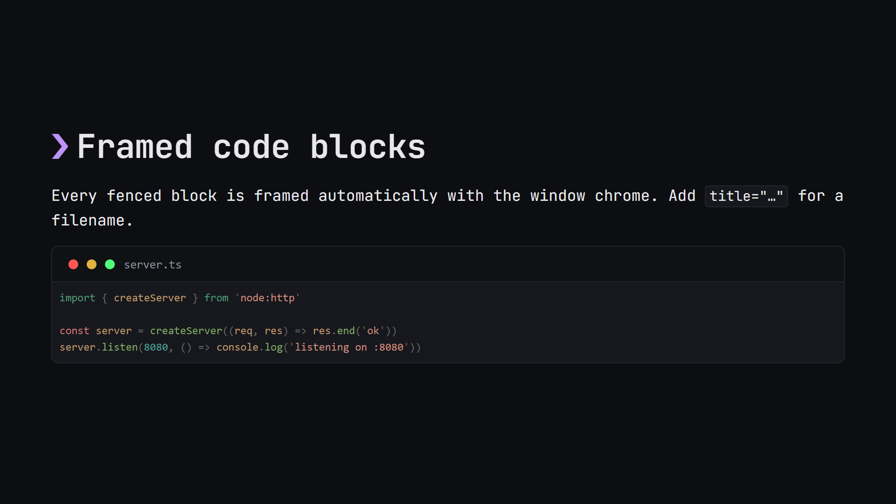

#### Terminal

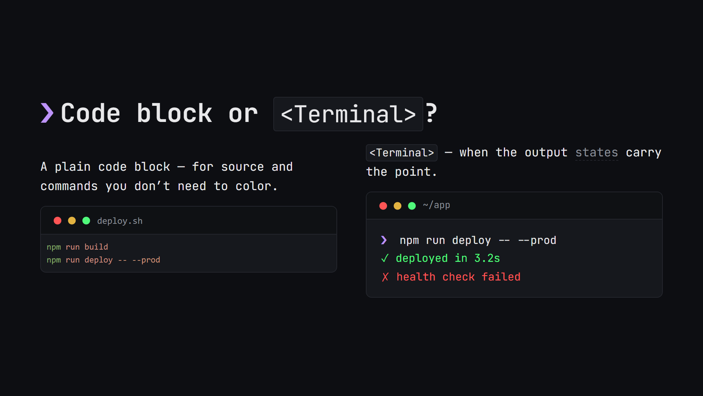

#### Callouts

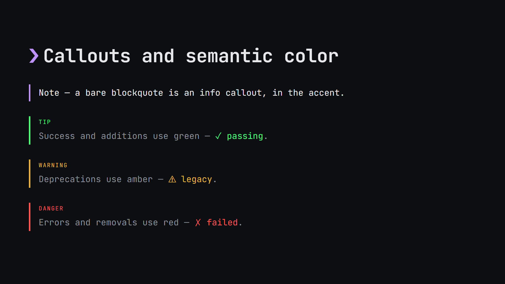

#### Tables

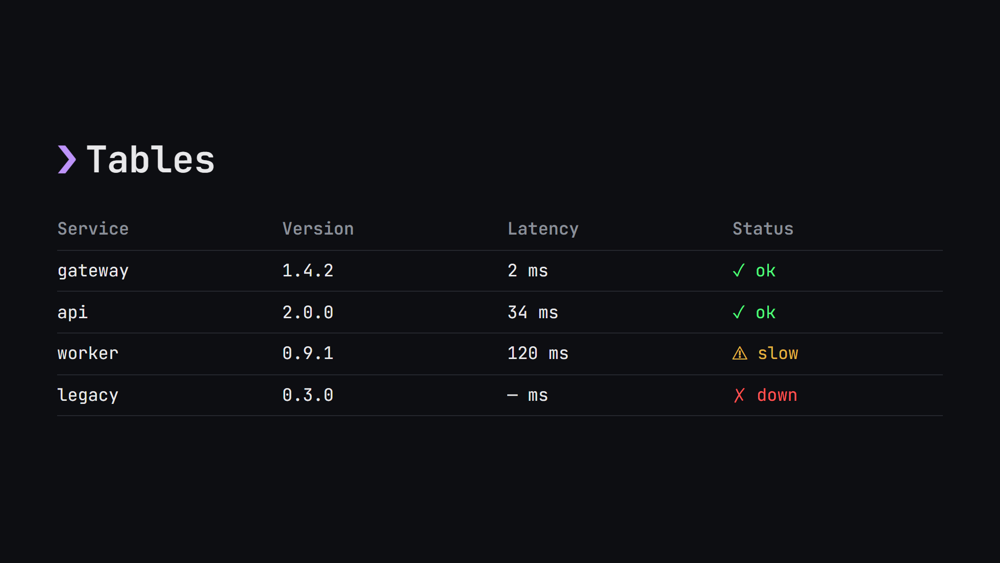

## Usage

Install the theme:

```bash
npm install @ricoapon/slidev-theme-technical
```

Then point your deck's headmatter at it (Slidev will also offer to install it
automatically on first run):

```yaml
---
theme: '@ricoapon/slidev-theme-technical'
themeConfig:
  accent: '#BD93F9'   # a single hex — the deck's one accent hue
  glyph: '❯'          # the prompt glyph before titles: ❯ (default), $, or #
transition: fade
---
```

That is the entire configuration:

| Key                  | Default   | Notes                                              |
|----------------------|-----------|----------------------------------------------------|
| `themeConfig.accent` | `#BD93F9` | A single hex — the deck's one accent hue.          |
| `themeConfig.glyph`  | `❯`       | The prompt glyph before titles. Also `$` or `#`.   |
| `colorSchema`        | `dark`    | Dark only.                                          |
| `transition`         | `fade`    | Set once; keep it quiet (`fade` or `slide-left`).  |

Suggested accents, all legible on the near-black background:

| Hue                  | Hex       | Feel                                  |
|----------------------|-----------|---------------------------------------|
| **Purple** (default) | `#BD93F9` | Signature default. Technical, modern. |
| Cyan                 | `#8BE9FD` | Cool, precise, "protocol."            |
| Blue                 | `#58A6FF` | Calm, trustworthy, neutral.           |
| Pink                 | `#FF79C6` | Playful, bold.                        |

### Authoring skill

The theme ships an opinionated companion skill at
[`skills/slidev-theme-technical/SKILL.md`](skills/slidev-theme-technical/SKILL.md)
covering *how* to author a technical deck with it — the per-deck choices, the
layout vocabulary, the components, and the one-accent discipline. Install it into
your agent with:

```bash
npx skills add ricoapon/slidev-theme-technical
```

## Layouts

| Layout      | Use it for…                                       | Slots / frontmatter     |
|-------------|---------------------------------------------------|-------------------------|
| `cover`     | Title slide, deck identity                        |                         |
| `section`   | Section breaks — the "breath" slides              | `no:`                   |
| `statement` | One punchy claim, 3–6 words, centered             |                         |
| `default`   | Title + a short list, steps, or small structure   |                         |
| `two-cols`  | Text beside a panel (terminal / code / diagram)   | `::left::` · `::right::` |
| `full`      | A single panel filling the screen (hero mode)     |                         |
| `center`    | A diagram or single figure, centered              |                         |

## Components

The set is deliberately tiny: **framed code blocks, `<Terminal>`, `<Cursor>`, and
themed Mermaid.** They share one visual language — same mono font, near-black
background, single accent, one corner radius, hairline borders — so any
combination looks native. There is one window chrome (three dots + an optional
label) used everywhere.

### Framed code blocks

Add `title="…"` for a filename in the chrome bar:

````md
```ts title="server.ts"
export const PORT = 8080
```
````

Code is highlighted with the `vitesse-dark` Shiki theme, set once in the theme.

### `<Terminal>`

A styled representation of shell **output**. A plain `bash` block is perfectly
fine; reach for `<Terminal>` only when the output *states* carry the point. Each
line is classified by its leading token:

| Leading token | Meaning          | Color        |
|---------------|------------------|--------------|
| `❯` `$` `#`   | prompt / command | accent caret |
| `✓` `+`       | success / added  | green        |
| `✗` `-`       | error / removed  | red          |
| `⚠` `!`       | warning          | amber        |
| (other)       | output           | muted        |

```md
<Terminal title="~/app">

​```bash
❯ pnpm build
✓ built in 1.24s
✗ 1 failed, 42 passed
​```

</Terminal>
```

| Prop     | Type              | Notes                                              |
|----------|-------------------|----------------------------------------------------|
| `title`  | string            | Label in the bar (a path or filename)              |
| `prompt` | string (`❯`)      | The prompt glyph to recognise / emphasise          |
| `reveal` | boolean           | Bind each line to a click, to step through output  |
| `cursor` | boolean           | Blinking cursor at the end of the last line        |
| `fill`   | boolean           | Grow to fill the slide (for the `full` layout)     |

### `<Cursor>`

A CSS-only blinking block cursor in the accent. Use it to end a prompt line, or
after a statement to give an empty slide a sign of life.

```md
# One idea. <Cursor />
```

| Prop    | Values                               | Notes                    |
|---------|--------------------------------------|--------------------------|
| `color` | `accent` (default) · `text` · a hex  | A raw hex is discouraged |

### Mermaid diagrams

Author diagrams in fenced ` ```mermaid ` blocks. Mark the one focused node with
`class NodeId accent` and it takes the accent:

````md
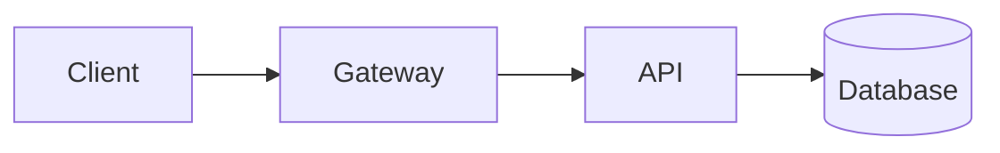
````

## Callouts and semantic color

Callouts are a colored left rule + label. A bare blockquote is a `note` / info
callout in the accent. The other kinds use the `callout` class:

```md
> Note — a bare blockquote is an info callout, in the accent.

<div class="callout tip">
<span class="callout-label">Tip</span>
Success uses green.
</div>
```

`tip` = green, `warning` = amber, `danger` = red. Inline marks reuse the same
set: `<span class="ok">✓</span>`, `<span class="warn">⚠</span>`,
`<span class="bad">✗</span>`.

The semantic set is fixed and always means the same thing:

| Meaning         | Color     | Used for                                             |
|-----------------|-----------|------------------------------------------------------|
| Success / added | `#50FA7B` | `✓` `+`, passing, added lines, `tip`                 |
| Error / removed | `#FF5555` | `✗` `-`, failures, stderr, removed lines, `danger`   |
| Warning         | `#E3B341` | warnings, deprecations, `warning`                    |
| Info            | *accent*  | note/info callouts, neutral emphasis                 |
| Comment / muted | `#5A5F68` | secondary output, timestamps                         |

## Typography and utilities

Everything is JetBrains Mono. The core rule is **big title, tiny support** — the
size contrast is the design. A few authoring conventions and helper classes:

- **Sentence case titles.** ALL CAPS only for tiny labels (`.tag`).
- **`<u>`** underlines a word with a thick accent rule (for emphasis in titles).
- **`**strong**`** and links take the accent; **`*em*`** is a muted dashed underline.
- **Lists** — `ul` gets a square accent marker, `ol` accent numerals.
- Helper classes: `.tag` (a small ALL-CAPS chip), `.accent`, `.muted`, `.caption`,
  and the inline marks `.ok` / `.warn` / `.bad`.

## Color tokens

The whole system is exposed as CSS variables, so a rare per-deck override reads
from one place. Defined in [`styles/base.css`](styles/base.css):

| Token         | Value         | Role                      |
|---------------|---------------|---------------------------|
| `--bg`        | `#0D0E12`     | Background                |
| `--surface`   | `#16181D`     | Panels, code, terminal    |
| `--text`      | `#E8E8EA`     | Primary text              |
| `--muted`     | `#8A8F98`     | Secondary text            |
| `--faint`     | `#5A5F68`     | Comments, captions        |
| `--border`    | `#24262D`     | Hairlines, borders        |
| `--accent`    | *from config* | The deck's one accent hue |
| `--c-success` | `#50FA7B`     | Semantic green            |
| `--c-error`   | `#FF5555`     | Semantic red              |
| `--c-warning` | `#E3B341`     | Semantic amber            |

## Offline

Every asset the theme needs is bundled, so a deck works fully offline.

## License

[MIT](LICENSE) © Rico Apon
