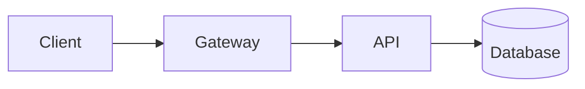

# Authoring with slidev-theme-technical

A durable, opinionated system so decks don't get redesigned from scratch each
time. The theme is a framework you drop into every deck: **choose an accent,
write content, done.** Keep authoring in Markdown; lean on the theme's panels
rather than hand-building anything.

The defining idea: **framed developer panels do the work photos do in other
decks.** Fill a sparse slide with a terminal, a code window, or a diagram — not
imagery. A technical audience reads that developer chrome as meaningful.

## Before you build — confirm the per-deck choices

Most of this is fixed. A few things are decided per deck. If the user hasn't
said, **ask first**; if they don't care, pick the default and say which:

1. **Accent color** — one hex value, the deck's signature hue. Default `#BD93F9`
   (purple).
2. **Prompt glyph** — the accent glyph before titles: `❯` (default), `$`, or `#`.
3. **Delivery** — offline (bundled fonts, the default) or online (CDN/remote
   embeds). If unsure, offline.

Everything else is fixed.

## The non-negotiables

If a deck follows only these, it already looks right:

1. **Monochrome base, one accent.** Near-black + white/gray, plus **one** accent
   hue. The accent may appear generously (glyph, active line, focused node) but
   is always the *same one color*. Never a second decorative hue.
2. **Everything is monospace.** One typeface (JetBrains Mono, shipped by the
   theme) for titles, body, code and chrome. No sans companion.
3. **One idea per slide, almost no text.** A big title and a few short phrases.
   If it reads like a paragraph, it belongs in the spoken delivery.
4. **Framed panels fill the screen.** Terminals, code windows and diagrams
   carry the meaning. They come from the theme, not bespoke markup.
5. **A fixed, small layout vocabulary.** Seven layouts, reused. No bespoke layout
   per slide.

Semantic color (success green / error red / warning amber) and syntax
highlighting are **not** decoration — they carry meaning and are allowed. They
don't count as a second accent.

## Headmatter

The entire per-deck setup lives in the deck's headmatter:

```yaml
---
theme: '@ricoapon/slidev-theme-technical'
themeConfig:
  accent: '#BD93F9'   # a single hex — the deck's one accent hue
  glyph: '❯'          # the prompt glyph before titles: ❯ (default), $, or #
transition: fade      # one quiet transition; do not vary per slide
colorSchema: dark     # dark only
---
```

Per-slide layout is set in each slide's frontmatter: `---\nlayout: two-cols\n---`.

## Layout vocabulary

Set `layout:` in slide frontmatter. Alternate *breath* (`section` / `statement`)
with *substance* (`default` / `two-cols` / `full`). **No more than two or three
dense panels before a breath slide** — a run of code slides is what makes a
technical deck exhausting.

| Layout      | Use it for…                                     | Authoring                                             |
|-------------|-------------------------------------------------|-------------------------------------------------------|
| `cover`     | Title slide, deck identity                      | `# Title` + one supporting line                       |
| `section`   | Section breaks — the "breath" slides            | `no: '01'` sets the big accent number, then `# Title` |
| `statement` | One punchy claim, 3–6 words, centered           | just `# The claim` (optionally end with `<Cursor />`) |
| `default`   | Title + a short list, steps, or small structure | `# Title` + a tight body                              |
| `two-cols`  | Text beside a panel                             | `::left::` / `::right::`; text one side, panel other  |
| `full`      | One panel filling the screen (hero mode)        | `# Title` + one panel (`<Terminal … fill>`)           |
| `center`    | A diagram or single figure, centered            | `# Title` + one figure                                |

There is **no closing layout** — build a "thanks / links" slide from `statement`
or `center`.

`two-cols` example:

```md
---
layout: two-cols
---

# Text beside a panel

::left::

* Short point one
* Short point two

::right::

<Terminal title="~/deploy">

​```bash
❯ kubectl apply -f app.yaml
✓ rollout complete
​```

</Terminal>
```

## Components

Every sparse slide gets **one** panel — a statement + one terminal, a claim +
one diagram, a title + one code window. **Never two big panels competing on the
same slide.** All panels share one window chrome (three dots + optional label).

### Framed code blocks — the default

Write an ordinary fenced block; the theme frames it automatically with Shiki
highlighting. Add `title="…"` for a filename in the bar:

````md
```ts title="server.ts"
export const PORT = 8080
```
````

Slidev's own code powers work inside the frame: line highlighting
`{1,3-5|all}`, Shiki Magic Move (```` ```ts {*}{lines:true} ````), `<v-clicks>`,
Monaco. Prefer highlighting / magic-move over pasting successive full snippets.
Don't lean on multi-step highlighting in exported/PDF decks — it reads as jumpy
when static.

### `<Terminal>` — shell output

Optional. A plain `bash` block is fine. Reach for `<Terminal>` only when the
output *states* carry the point (passing/failing, added/removed). It is a styled
representation, not a live shell. Each line is classified by its leading token:

- `❯` / `$` / `#` → prompt line: accent caret + the typed command
- `✓` / `+` → success / added (green)
- `✗` / `-` → error / removed / stderr (red)
- `⚠` / `!` → warning (amber)
- anything else → muted output

```md
<Terminal title="~/app">

​```bash
❯ pnpm build
✓ built in 1.24s
✗ 1 failed, 42 passed
​```

</Terminal>
```

Props: `title` (bar label), `prompt` (`❯`/`$`/custom), `reveal` (bind each line
to a click), `cursor` (trailing blinking cursor), `fill` (grow to the slide, for
`full`). Leave a blank line before and after the inner ```` ```bash ```` fence.

### `<Cursor>` — blinking block cursor

A CSS-only blinking block in the accent. Always a block, always blinking. End a
statement or a title to give an empty slide a sign of life:

```md
# One idea. <Cursor />
```

Prop: `color` — `accent` (default) · `text` · a raw hex (discouraged).

### Mermaid — themed

Author in fenced ` ```mermaid ` blocks; no component. Panel-colored nodes, mono labels,
hairline edges. Mark the **one** focused node with `class NodeId accent` to give
it the accent. One diagram per slide, generous spacing.

````md

````

Categorical color (one hue per service/series) is out of scope — distinguish
with grayscale + shape/position + labels, accent only on the focused element.

## Callouts and semantic color

A bare blockquote is a `note` / info callout in the accent. Other kinds use the
`callout` class with a `callout-label`. Colored left rule + label, never a fill.

```md
> Note — a bare blockquote is an info callout, in the accent.

<div class="callout tip">
<span class="callout-label">Tip</span>
Success uses green.
</div>
```

`tip` = green, `warning` = amber, `danger` = red. The fixed semantic set:

| Meaning         | Color     | Inline mark                   |
|-----------------|-----------|-------------------------------|
| Success / added | `#50FA7B` | `<span class="ok">✓</span>`   |
| Error / removed | `#FF5555` | `<span class="bad">✗</span>`  |
| Warning         | `#E3B341` | `<span class="warn">⚠</span>` |
| Info            | *accent*  | —                             |

## Type and utilities

Everything is JetBrains Mono. **Big title, tiny support** — the size contrast is
the design. Sentence case titles (ALL CAPS only for tiny `.tag` labels).

- `<u>word</u>` — thick accent underline, for emphasis inside a title.
- `**strong**` and links take the accent; `*em*` is a muted dashed underline.
- `ul` gets a square accent marker; `ol` gets accent numerals (use for steps).
- Helper classes: `.tag` (small ALL-CAPS chip), `.accent`, `.muted`, `.caption`,
  and inline `.ok` / `.warn` / `.bad`.

> **Inline markdown inside a raw block `<div>` is NOT parsed.** Put links and
> inline code in a normal markdown paragraph (inline `<span>`s are fine there);
> reserve `<div class="callout …">` for callout bodies with plain text.

## Discipline

- **Minimize per-deck CSS, custom layouts, and custom components.** Nearly every
  slide should need none. The one knob that changes a deck's feel is the accent.
- Build a custom component only for the single diagram or interaction a talk
  hinges on — in the theme's language (near-black + the one accent, JetBrains
  Mono, hairline borders, same radius) so it looks native.

## Checklist

Per deck: one accent hex chosen up front · delivery confirmed · no slide is a
wall of text · `section`/`statement` break up dense runs (≤2–3 dense in a row) ·
little to no custom CSS.

Per slide: big title + minimal support (sentence case, optional accent glyph) ·
fits one of the seven layouts · at most **one** big panel · all accent uses are
the same hue · everything is JetBrains Mono · would still make sense with the
body text cut in half.
