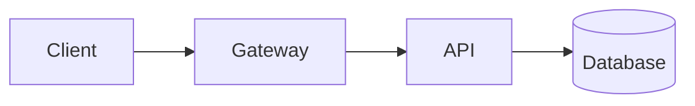

# Slides for <u>technical talks</u>

A monospace, near-black Slidev theme — a calm, consistent home for your code,
commands, and diagrams.

---
layout: section
no: '01'
---

# The section layout

---
layout: default
---

# The default layout

Title plus a tight body — the workhorse for content slides. Reach for it when a
claim needs a few supporting lines:

* A short bulleted list
* A few numbered steps
* One small table or code block

---
layout: two-cols
---

# The two-cols layout

::left::

Text on one side, a framed panel on the other — a code window, a diagram, or a
terminal. Keep the text to a few short lines.

::right::

```ts title="user.ts"
export interface User {
  id: string
  name: string
  email: string
}
```

---
layout: full
---

# The full layout

```yaml title="docker-compose.yml"
services:
  api:
    build: .
    ports:
      - '8080:8080'
    environment:
      NODE_ENV: production
    depends_on:
      - db
  db:
    image: postgres:16
    volumes:
      - pgdata:/var/lib/postgresql/data

volumes:
  pgdata: {}
```

---
layout: center
---

# The center layout



---
layout: statement
---

# One idea. <u>Nothing else.</u>

---
layout: default
---

# Framed code blocks

Every fenced block is framed automatically with the window chrome. Add
`title="…"` for a filename.

```ts title="server.ts"
import { createServer } from 'node:http'

const server = createServer((req, res) => res.end('ok'))
server.listen(8080, () => console.log('listening on :8080'))
```

---
layout: two-cols
---

# Code block or `<Terminal>`?

::left::

A plain code block — for source and commands you don't need to color.

```bash title="deploy.sh"
npm run build
npm run deploy -- --prod
```

::right::

`<Terminal>` — when the output *states* carry the point.

<Terminal title="~/app">

```bash
❯ npm run deploy -- --prod
✓ deployed in 3.2s
✗ health check failed
```

</Terminal>

---
layout: default
---

# Callouts and semantic color

> Note — a bare blockquote is an info callout, in the accent.

<div class="callout tip">
<span class="callout-label">Tip</span>
Success and additions use green — <span class="ok">✓ passing</span>.
</div>

<div class="callout warning">
<span class="callout-label">Warning</span>
Deprecations use amber — <span class="warn">⚠ legacy</span>.
</div>

<div class="callout danger">
<span class="callout-label">Danger</span>
Errors and removals use red — <span class="bad">✗ failed</span>.
</div>

---
layout: default
---

# Tables

| Service   | Version | Latency | Status                           |
|-----------|---------|---------|----------------------------------|
| gateway   | 1.4.2   |    2 ms | <span class="ok">✓ ok</span>     |
| api       | 2.0.0   |   34 ms | <span class="ok">✓ ok</span>     |
| worker    | 0.9.1   |  120 ms | <span class="warn">⚠ slow</span> |
| legacy    | 0.3.0   |    — ms | <span class="bad">✗ down</span>  |
