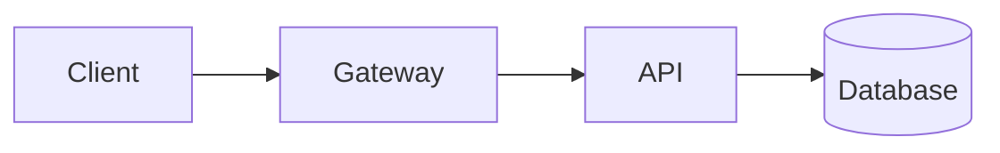

# Framed surfaces, <u>one accent</u>

An editor-at-night aesthetic for technical talks — monospace, near-black, and a
single accent hue running through the deck.

---
layout: section
no: '01'
---

# The layout vocabulary

---
layout: default
---

# What the theme ships

* Seven fixed layouts — no bespoke layout per slide
* Framed code blocks, with an optional filename
* `<Terminal>` and `<Cursor>` for shell output
* Themed Mermaid diagrams
* One accent hex re-skins the whole deck

---
layout: default
---

# Code blocks are framed automatically

````md title="slides.md"
```ts title="server.ts"
export const PORT = 8080
```
````

Add `title="…"` to any fence and the filename shows in the bar — native to the
code block, no component. Slidev's own code powers (line highlighting,
magic-move, Monaco) work inside too; those are Slidev features, not the theme's.

---
layout: default
---

# `<Terminal>` renders shell output

A plain `bash` block is fine and gets syntax highlighting. Use `<Terminal>` only
when you want shell semantics — an accent caret and colored status.

<Terminal title="~/app">

```bash
❯ pnpm build
✓ built in 1.24s
❯ pnpm test
✗ 1 failed, 42 passed
⚠ deprecated flag --legacy
```

</Terminal>

---
layout: two-cols
---

# Text beside a surface

::left::

* Prompt caret in the accent
* Muted output lines
* Semantic colors for status

::right::

<Terminal title="~/deploy">

```bash
❯ kubectl apply -f app.yaml
service/app created
✓ rollout complete
```

</Terminal>

---
layout: full
---

# The hero: one surface, full screen

<Terminal title="~/observability" fill>

```bash
❯ tail -f api.log
[12:04:01] GET /health 200 2ms
[12:04:02] GET /users 200 34ms
[12:04:02] POST /users 201 88ms
[12:04:03] GET /users/42 200 11ms
[12:04:04] GET /users/99 404 6ms
[12:04:05] GET /health 200 2ms
```

</Terminal>

---
layout: center
---

# Themed Mermaid diagrams



---
layout: statement
---

# One accent. <u>Everywhere.</u> <Cursor />

---
layout: default
---

# Callouts and semantic color

> Note — a bare blockquote is an info callout, in the accent.

<div class="callout tip">
<span class="callout-label">Tip</span>
Success and additions use green — <span class="ok">✓ passing</span>.
</div>

<div class="callout warning">
<span class="callout-label">Warning</span>
Deprecations use amber — <span class="warn">⚠ legacy</span>.
</div>

<div class="callout danger">
<span class="callout-label">Danger</span>
Errors and removals use red — <span class="bad">✗ failed</span>.
</div>

---
layout: default
---

# Tabular everything

| Service   | Version | Latency | Status         |
|-----------|---------|---------|----------------|
| gateway   | 1.4.2   |    2 ms | <span class="ok">✓ ok</span>   |
| api       | 2.0.0   |   34 ms | <span class="ok">✓ ok</span>   |
| worker    | 0.9.1   |  120 ms | <span class="warn">⚠ slow</span> |
| legacy    | 0.3.0   |    — ms | <span class="bad">✗ down</span>  |
